# Darkly

Introductory project to computer security in the specific field of the web, this project will have you dissect a vulnerable website.

To accesss the ip / app to test, install darkly iso in a VM (VirtualBox or VMWare) and start it (port forward guest 80 to host 8080), the app will be available at `http://localhost:8080`

## Resources

- OWASP WebSec GUIDE: https://owasp.org/www-project-web-security-testing-guide/
  - Lastest: https://github.com/OWASP/wstg/tree/master
  - Stable pdf (2025): https://github.com/OWASP/wstg/releases/download/v4.2/wstg-v4.2.pdf
- OWASP - Database recommandation: https://cheatsheetseries.owasp.org/cheatsheets/Database_Security_Cheat_Sheet.html

- ZAP - Automation Testing Tool recommended by OWASP: https://www.zaproxy.org/

## Notes

SDLC (Software Development Life Cycle) should included security Testing to ensure security is covered and controlled throughout entire development process.

```mermaid
flowchart LR
    classDef phase fill:#1976d2,color:#fff,stroke:#1976d2

    P["<b>Planning</b>
    • Define purpose & scope
    • Set timelines & resources"] -->|Complete Phase| R["<b>Requirements</b>
    • Gather expectations
    • Document specifications"]

    R -->|Requirements Ready| D["<b>Design</b>
    • Create architecture
    • Plan interfaces"]

    D -->|Design Complete| C["<b>Coding</b>
    • Write software
    • Code reviews"]

    C -->|Code Ready| T["<b>Testing</b>
    • Identify bugs and exploits
    • Quality assurance"]

    T -->|Pass Testing| DE["<b>Deployment</b>
    • Release software
    • Initial setup"]

    DE -->|Monitor & Update| M["<b>Maintenance</b>
    • Fix issues
    • Add features"]

    M -.->|New Requirements| P

```

